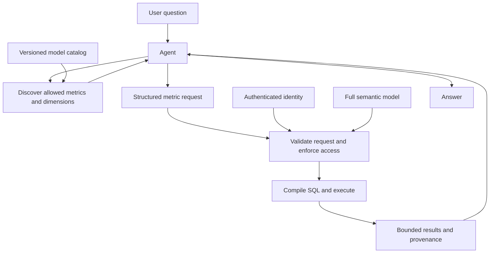

# Semantic models and agent queries

## Why use a cube?

YAML is a text format. It does not require a `cubes:` key. That key belongs to Cube's modeling language. If ai-system-gen uses a custom semantic loader, the loader defines its own schema; renaming a section `cubes` will not add a query compiler or security enforcement.

A cube groups a dataset's source, dimensions, measures, and relationships. Dimensions describe how to filter or group data; measures define aggregations. `supplier_quality.defect_ppm` gives applications a stable metric name while the model owns the formula. Cube can compile requests using those definitions. A cube definition does not itself mean that data has been copied into a materialized OLAP cube. See the [Cube reference](https://docs.cube.dev/reference/data-modeling/cube).

In your example, the intended benefit is shared meaning:

| Definition | What it establishes |
| --- | --- |
| `sql_table` | Which source supplies inspection records. |
| Primary key and documented grain | What one row represents, and which field uniquely identifies it. |
| Dimensions | Allowed groupings and filters, such as plant and inspection date. |
| Measures | Approved calculations, such as defect PPM. |
| Joins | Related entities and their expected cardinality. |
| Enforced access policy | Which records the authenticated caller can read. |

For example, consider two batches: 1 defect in 10 inspected parts and 1 defect in 990. Their combined rate is `1,000,000 × 2 / 1,000 = 2,000 PPM`. Averaging the two batch rates would give about `50,505 PPM`. Your ratio of aggregated totals expresses the first definition. The agent should select that metric, not invent its own formula.

## Does every table need its own file?

No. Physical tables, logical cubes, and source files are separate choices. Model the datasets needed for supported business questions. Leave staging, ingestion logs, and unused operational tables outside the agent's analytical catalog.

Cube commonly uses one cube per file; a YAML `cubes` list can hold several definitions. A cube can bind to a table or a SQL-derived dataset. File count is a maintenance choice, not an agent-context requirement. See the [Cube reference](https://docs.cube.dev/reference/data-modeling/cube).

For ai-system-gen, start with one reviewed model per useful business entity or fact dataset, grouped by domain. Use multiple cubes in one file only when they remain small and have the same owner. Keep different grains separate: an inspection, a shipment, and a purchase-order line represent different events.

This is a proposed structure for a future Cube project, not files implemented by this documentation change:

```text
model/
  cubes/
    shared/
      suppliers.yaml
      parts.yaml
      plants.yaml
    quality/
      supplier_quality.yaml
    procurement/
      purchase_order_lines.yaml
    logistics/
      shipments.yaml
    manufacturing/
      program_bom.yaml
  views/
    supplier_performance.yaml
    program_readiness.yaml
```

Cube views expose selected members from underlying cubes and can specify join paths. Use them to publish a focused interface for each analytical use case. See the [view reference](https://docs.cube.dev/reference/data-modeling/view).

If the business eventually needs hundreds of models, hundreds of reviewed files may be reasonable. Avoid forcing unrelated datasets into one file merely to reduce the count.

## How should the agent receive the models?

Keep the full model in the query service. Give the agent a small catalog and tools that return only the definitions relevant to its question. This is a proposed ai-system-gen design, not automatic behavior supplied by YAML.



Suggested application tools:

1. `search_metrics(question)` returns permitted metric names, descriptions, domains, and units. Search by exact names, business synonyms, and semantic similarity; similarity alone can select the wrong metric.
2. `describe_model(names)` returns selected definitions, grain, allowed dimensions, time fields, and supported relationships. Include required related definitions when a question crosses domains.
3. `query_metrics(request)` validates member names, filters, time ranges, join compatibility, and limits before invoking the semantic query engine. The server attaches identity from the authenticated session.

For "defect PPM by supplier at Austin during August 2026," the agent can submit a Cube-style query:

```json
{
  "measures": ["supplier_quality.defect_ppm"],
  "dimensions": ["supplier_quality.supplier_id"],
  "filters": [
    {
      "member": "supplier_quality.plant_location",
      "operator": "equals",
      "values": ["Austin"]
    }
  ],
  "timeDimensions": [
    {
      "dimension": "supplier_quality.inspection_date",
      "dateRange": ["2026-08-01", "2026-08-31"]
    }
  ],
  "limit": 100
}
```

Set the reporting timezone explicitly in the integration. An Austin filter does not grant Austin access; the server must also apply the caller's allowed plants. Return metric names, applied filters, units, timezone, source freshness, model version, and truncation status with results. Keep result and retrieval budgets explicit.

Discovery can fetch another model when needed. If a requested metric or join is missing, report that gap instead of allowing the agent to invent SQL. The model registry must preserve dependencies even when the prompt contains only a subset of descriptions.

## What needs checking in the supplied YAML?

- **Inspection grain.** Confirm that `inspection_id` is unique and non-null at the source's actual grain. If each batch has several part-level rows, `type: count` may not mean the number of inspection events. Define distinct event counting separately if needed.
- **BOM join.** `part_number` can occur across programs, plants, revisions, or BOM positions. `many_to_one` is valid only if each inspection row matches at most one target row. Establish the correct key or model a bridge. Declaring a relationship does not make source rows unique.
- **Joined models.** The referenced `suppliers` and `program_bom` cubes need definitions and valid keys. Cube uses declared relationships and primary keys to handle row multiplication; incorrect metadata can produce incorrect measures. See [joins and primary keys](https://docs.cube.dev/reference/data-modeling/joins).
- **Lead-time grain.** Averaging a delivery value repeated on inspection rows weights deliveries by their inspection counts. Model delivery lead time at the shipment or order grain if that is the intended business measure.
- **Criticality meaning.** `is_critical_part` currently derives from a field described as supplier importance. Confirm whether supplier criticality and part criticality are actually the same business concept.
- **Risk coverage.** The description mentions risk scores, but no risk-score member appears in the model. Add an approved definition if questions require it.
- **Access-control syntax.** The pasted `access_control.rules` block is custom pseudocode. Cube documents `access_policy` with `row_level` filters, along with server-side mechanisms such as `queryRewrite`. Choose and test the mechanism supported by the deployed version. See [Cube's access-control guidance](https://cube.dev/blog/ensuring-data-governance-with-cube-cloud-implementing-fine-grained-access).
- **Policy meaning.** The comment promises an `all_plants` claim, while the template checks the `Executive` role. Resolve that mismatch. Do not build SQL by joining unquoted claim strings. Missing or empty claims must deny access; use verified identity and the engine's supported filtering mechanism.

Before deployment, compile against the pinned Cube version and database dialect. Check key uniqueness, joins with repeated BOM parts, the weighted PPM example, zero inspected quantity, and access for allowed, forbidden, and empty plant claims. Parsing YAML alone does not validate those behaviors.

The architecture review proposes a semantic metric gateway. Cube is one way to implement it. A custom gateway can also work, but then ai-system-gen owns model validation, SQL compilation, join correctness, authorization, and query limits. Keeping YAML only in a prompt does not provide those guarantees.
